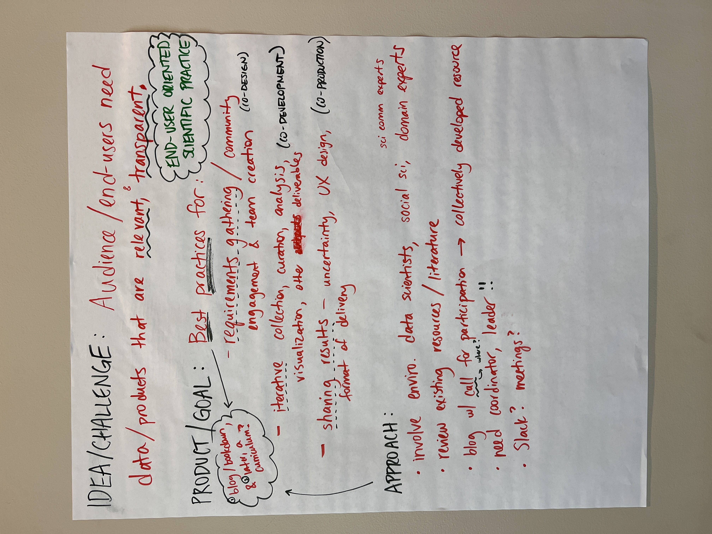

### NCEAS EDS Summit 2024 Working Group: End-User Oriented Scientific Practice

**Idea/Challenge** Audience/end-users need data/products that are *relevant* & *transparent*.

**Product/Goal**

-   Best practices for:

-   requirements gathering/ community engagement & team creation (*co-design*)

-   iterative collection, curation, analysis, visualization, other deliverables (*co-development*)

-   sharing results

-   uncertainty, UX design, format of delivery (*co-production*)

**Approach**

-   involve environmental data scientists, social scientist, science communication experts, domain experts

-   review existing resources/literature

-   blog/survey with call for participation -\> collectively developed resource

-   coordinator leader

-   slack/meetings/email

